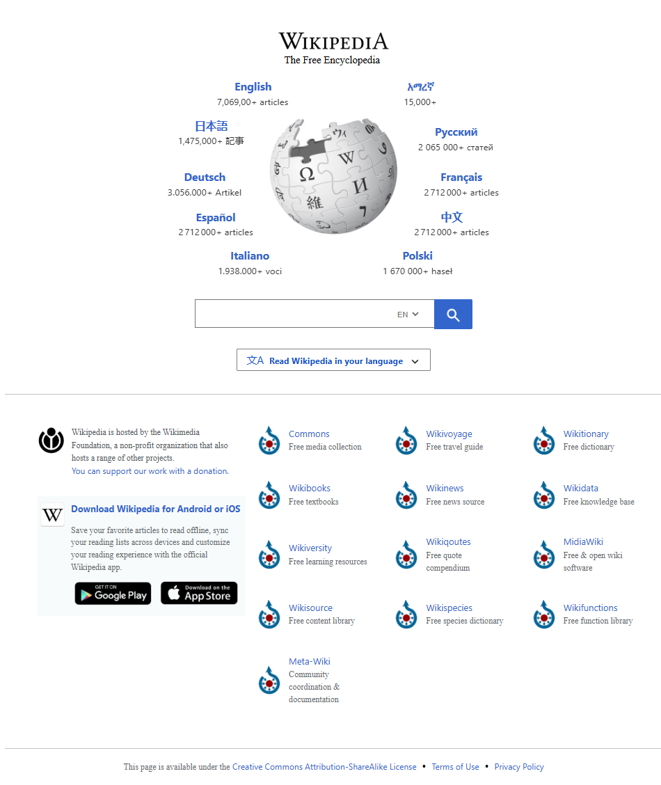

# Wikipedia Clone

This is a simple clone of Wikipedia, built using HTML, CSS, and JavaScript. It features a search functionality that allows users to search for articles and display relevant information in a structured format. The page layout and design are inspired by the look and feel of Wikipedia, providing a similar user experience.

### Features
- **Search Bar**: Allows users to search for articles.
- **Article Display**: Shows article title, content, and relevant links.
- **Responsive Layout**: Optimized for desktop and mobile devices.

### Screenshot

### Technologies Used
- HTML
- CSS
- JavaScript
- Wikipedia API (for fetching article content)

### Getting Started
1. Clone or download the repository.
2. Open `index.html` in your browser.
3. Use the search bar to look up Wikipedia articles.

### License
This project is licensed under the MIT License - see the [LICENSE](LICENSE) file for details.
